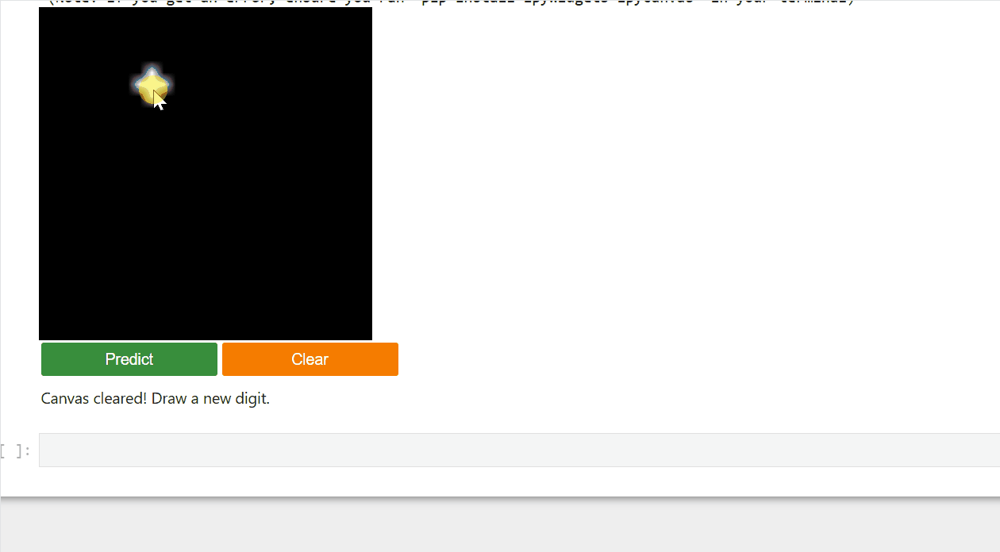

# Digit Recognition App: End-to-End Deep Learning Pipeline


## Overview
This project is an end-to-end, pedagogically structured Machine Learning pipeline that teaches a computer to recognize handwritten digits (0-9) using the MNIST dataset. 

Rather than relying purely on modern frameworks, this project takes an **engineering-first approach**. It bridges the gap between foundational calculus (building neural networks from scratch using pure matrix math) and state-of-the-art Deep Learning (deploying Convolutional Neural Networks with PyTorch). It culminates in a real-time, interactive drawing application built directly into the Jupyter environment.

## Interactive Real-Time Inference
*(Below is a demonstration of the live `ipycanvas` widget feeding native 28x28 arrays directly into the trained PyTorch CNN)*



## Technical Architecture & Workflow

The pipeline is divided into structured phases, demonstrating both theoretical understanding and practical deployment:

### Phase 1: Pure Math (NumPy MLP)
* **Architecture:** 784 (Input) → 128 (Hidden) → 10 (Output).
* **Implementation:** Built entirely from scratch without ML frameworks.
* **Math:** Explicit implementation of Forward Propagation, Cross-Entropy Loss gradients, and Backward Propagation (symbolic derivation of the Chain Rule).
* **Activations:** Custom ReLU and numerically stable Softmax functions.

### Phase 2: Modern Framework Scaling (PyTorch & CNNs)
* **Transition:** Rebuilt the NumPy MLP in PyTorch (`nn.Module`) to demonstrate the power of `Autograd` and `DataLoader` batching.
* **Advanced Vision:** Engineered a custom **Convolutional Neural Network (SimpleCNN)** featuring `Conv2d` (with padding/stride calculations) and `MaxPool2d` to capture spatial hierarchies. Achieved **~98% test accuracy** in just 3 epochs using the Adam optimizer.

### Phase 3: Sequence Data (RNNs)
* **Exploration:** Implemented a minimal `nn.RNN` to predict the next digit in a sequential series, demonstrating the handling of hidden states and temporal memory.

### Phase 4: Production & Deployment
* **Model Persistence:** State dictionaries (`.pth`) are saved and loaded to prevent redundant training.
* **Hyperparameter Analysis:** Mapped out learning rate sensitivity (divergence vs. slow convergence) using `matplotlib`.
* **Interactive Frontend:** Deployed a true HTML5 canvas widget (`ipycanvas`) with anti-aliased brush strokes and synchronized backend NumPy arrays for real-time model inference.

## Tech Stack
* **Core:** Python
* **Deep Learning:** PyTorch, Torchvision
* **Mathematics & Data:** NumPy
* **Visualization & UI:** Matplotlib, ipywidgets, ipycanvas

## How to Run Locally

1. **Clone the repository:**
   ```bash
   git clone [https://github.com/YourUsername/digit-recognition-pipeline.git](https://github.com/AbbasRaza5055/digit-recognition-pipeline.git)
   cd digit-recognition-pipeline


Set up your virtual environment:

Bash
python -m venv digit_env
source digit_env/bin/activate  # On Windows use: digit_env\Scripts\activate
Install the required dependencies:

Bash
pip install torch torchvision numpy matplotlib ipywidgets ipycanvas jupyter
Launch the Notebook:

Bash
jupyter notebook Digit_Recognition_APP_upgraded.ipynb

Note: Ensure you run all cells sequentially. The interactive widget at the end requires a live kernel to process drawing events.
